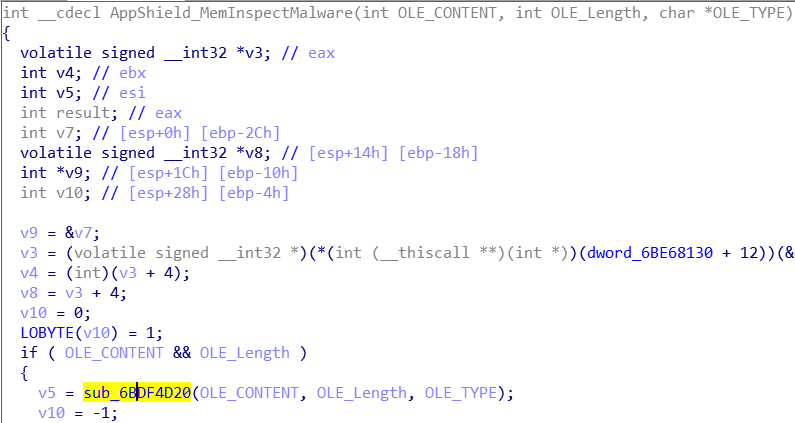

## Hancom BodyText stream Integer Overflow in HncAppShield

### Affected Software
~~~shell
start    end        module name
6bdf0000 6be70000   HncAppShield   (export symbols)       C:\Program Files (x86)\Hitencent\JisuOffice\Office96\Bin\HncAppShield.dll
    Loaded symbol image file: C:\Program Files (x86)\Hitencent\JisuOffice\Office96\Bin\HncAppShield.dll
    Image path: C:\Program Files (x86)\Hitencent\JisuOffice\Office96\Bin\HncAppShield.dll
    Image name: HncAppShield.dll
    Timestamp:        Thu Mar 29 16:22:16 2018 (5ABCA238)
    CheckSum:         0008424D
    ImageSize:        00080000
    File version:     9.0.0.34
    Product version:  9.0.0.34
    File flags:       0 (Mask 17)
    File OS:          4 Unknown Win32
    File type:        2.0 Dll
    File date:        00000000.00000000
    Translations:     0412.04b0
    ProductName:      HncAppShield 동적 연결 라이브러리-Root
    InternalName:     HncAppShield.dll
    OriginalFilename: HncAppShield.dll
    ProductVersion:   9, 0, 0, 34
    FileVersion:      9, 0, 0, 34
    FileDescription:  Hancom Office App Shield
    LegalCopyright:   Copyright (C) 2016 Hancom Inc.

~~~

### Product Background
Hancom Office is the only Office software you need to edit in a variety of formatsand translate into many languages,all from wherever you are.
It is widely used in Korean.

### Vulnerability Details
When processing .hwp files, NEO Office doesn't check the BodyText stream correctly, which leads to Integer Overflow.

Crash Context

~~~shell
0:009> g
(e70.eb8): Access violation - code c0000005 (!!! second chance !!!)
eax=00000000 ebx=000000c0 ecx=00000000 edx=20929ffe esi=0002173c edi=20a9d8c4
eip=6bdf4419 esp=228324e0 ebp=00000000 iopl=0         nv up ei pl zr na pe nc
cs=0023  ss=002b  ds=002b  es=002b  fs=0053  gs=002b             efl=00010246
HncAppShield!AppShield_InspectMalware+0x2fe9:
6bdf4419 8a1c3e          mov     bl,byte ptr [esi+edi]      ds:002b:20abf000=??
~~~

**HncAppShield.dll Base Address:0x6BDF0000**

There is a HncAppShield.dll in the installation folder of the NEO Office, when a document file is open, this module will try to make sure there is no malicious code in the document. This dll has several export functions, one of them is ***AppShield_MemInspectMalware***, this function is used to check a specific memory region. There are three parameters for this function, the first one is a pointer points to the buffer region to check, the second indicates the length of the buffer and the last one is a pointer points to the type of the buffer, such as "BodyText", "DocInfo", etc.

The logic of this function is not complicated and the main process is in ***sub_6BDF4D20***.

The three parameters passed to ***AppShield_MemInspectMalware*** will be passed to ***sub_6BDF4D20***. This function will have different check flow according to different OLE_TYPE. For example, a "BodyText" stream will be checked in the following code:

~~~C
else if ( !strncmp(OLE_TYPE_LOCAL, "BodyText", 8u) )
  {
    OLE_LENGTH_LOCAL_ = OLE_Length;
    OLE_offset = 0;
    v28 = 0;
    if ( OLE_Length )
    {
      do
      {
        v11 = (*(_DWORD *)(OLE_offset + OLE_CONTENT) >> 0x14) & 0xFFF;
        if ( v11 > 0x100 )
        {
          if ( v11 == 0xFFF )
          {
            v11 = *(_DWORD *)(OLE_offset + OLE_CONTENT + 4);
            OLE_offset += 4;
          }
          if ( v11 + OLE_offset + 4 > OLE_LENGTH_LOCAL_ )
            v11 = OLE_LENGTH_LOCAL_ - OLE_offset - 4;
          if ( sub_6BDF42F0(v11, &v29, OLE_offset + OLE_CONTENT + 4, &v26) )
          {
            v26 += 768;
            if ( v26 == 785 )
              ++v28;
            if ( v28 > 1 )
              goto LABEL_85;
          }
          OLE_LENGTH_LOCAL_ = OLE_Length;
        }
        OLE_offset += v11 + 4;
      }
      while ( OLE_offset < OLE_LENGTH_LOCAL_ );
    }
  }
~~~

For the above code, we will mainly focus on ***v11*** , this variable seems to be some kind of *length*. Its initialization process is:

~~~c
v11 = (*(_DWORD *)(OLE_offset + OLE_CONTENT) >> 0x14) & 0xFFF;
~~~

At the begining, OLE_offset is set to 0, so ***v11*** is related with the first 4 bytes of OLE_CONTENT, but OLE_CONTENT is controlled by the attacker.

There seems a check of v11 to ensure it not too long:

~~~C
 if ( v11 + OLE_offset + 4 > OLE_LENGTH_LOCAL_ )
            v11 = OLE_LENGTH_LOCAL_ - OLE_offset - 4;
~~~

**But this check will cause an Ingeger Overflow**, if v11 is 0xFFFFFFFF, then this check is useless. How can we set v11 to 0xFFFFFFFF before this check? It's easy enough, if (*(_DWORD *)(OLE_offset + OLE_CONTENT) >> 0x14) & 0xFFF == 0xFFF, then v11 will be *(_DWORD *)(OLE_offset + OLE_CONTENT + 4), don't forget OLE_CONTENT is controlled by the attacker. So let's debug our PoC to see what happens:

Open PoC.hwp with hwp.exe, and set a breakpoint at 0x6bdf4ed1, when the breakpoint is triggered, let's observe the registers:

~~~shell
0:009> g
Breakpoint 2 hit
eax=00007886 ebx=00000000 ecx=6be56898 edx=208c2074 esi=20a9d130 edi=00000007
eip=6bdf4ed1 esp=2285b6d8 ebp=2285b6fc iopl=0         nv up ei pl nz na po nc
cs=0023  ss=002b  ds=002b  es=002b  fs=0053  gs=002b             efl=00000202
HncAppShield!AppShield_InspectMalware+0x3aa1:
6bdf4ed1 8b3c33          mov     edi,dword ptr [ebx+esi] ds:002b:20a9d130=78864d42
0:009> da esi
20a9d130  "BM.x"
0:009> dd esi
20a9d130  78864d42 00000000 00360000 00280000
20a9d140  00660000 00640000 00010000 00000018
20a9d150  78500000 00000000 00000000 00000000
20a9d160  00000000 ffff0000 ffffffff ffffffff
20a9d170  ffffffff ffffffff ffffffff ffffffff
20a9d180  ffffffff ffffffff ffffffff ffffffff
20a9d190  ffffffff ffffffff ffffffff ffffffff
20a9d1a0  ffffffff ffffffff ffffffff ffffffff
~~~

ESI points to a memory region which seems to be a .bmp format, this is because we mutated the orign seed and the program treat this as BodyText. The important thing is that the first 4 bytes are 0x78864d42, after calculation of (*(_DWORD *)(OLE_offset + OLE_CONTENT) >> 0x14) & 0xFFF, ***v11*** will be 0x788. We continue the program, when this breakpoint is triggered the second time, let's observe the registers again:

~~~shell
0:009> g
Breakpoint 1 hit
eax=00007886 ebx=00000000 ecx=6be56898 edx=208c2074 esi=20a9d130 edi=00000007
eip=6bdf4ed1 esp=2285b6d8 ebp=2285b6fc iopl=0         nv up ei pl nz na po nc
cs=0023  ss=002b  ds=002b  es=002b  fs=0053  gs=002b             efl=00000202
HncAppShield!AppShield_InspectMalware+0x3aa1:
6bdf4ed1 8b3c33          mov     edi,dword ptr [ebx+esi] ds:002b:20a9d130=78864d42
0:009> g
Breakpoint 1 hit
eax=00007886 ebx=0000078c ecx=a7373d27 edx=208c3ea0 esi=20a9d130 edi=00000788
eip=6bdf4ed1 esp=2285b6d8 ebp=2285b6fc iopl=0         nv up ei ng nz na pe cy
cs=0023  ss=002b  ds=002b  es=002b  fs=0053  gs=002b             efl=00000287
HncAppShield!AppShield_InspectMalware+0x3aa1:
6bdf4ed1 8b3c33          mov     edi,dword ptr [ebx+esi] ds:002b:20a9d8bc=ffffffff
~~~

This time, edi will be 0xFFFFFFFF, after some calculation, v11 will be set to 0xFFFFFFFF

~~~shell
0:009> p
eax=00007886 ebx=0000078c ecx=a7373d27 edx=208c3ea0 esi=20a9d130 edi=ffffffff
eip=6bdf4ed4 esp=2285b6d8 ebp=2285b6fc iopl=0         nv up ei ng nz na pe cy
cs=0023  ss=002b  ds=002b  es=002b  fs=0053  gs=002b             efl=00000287
HncAppShield!AppShield_InspectMalware+0x3aa4:
6bdf4ed4 c1ff14          sar     edi,14h
0:009> p
eax=00007886 ebx=0000078c ecx=a7373d27 edx=208c3ea0 esi=20a9d130 edi=ffffffff
eip=6bdf4ed7 esp=2285b6d8 ebp=2285b6fc iopl=0         nv up ei ng nz na pe cy
cs=0023  ss=002b  ds=002b  es=002b  fs=0053  gs=002b             efl=00000287
HncAppShield!AppShield_InspectMalware+0x3aa7:
6bdf4ed7 81e7ff0f0000    and     edi,0FFFh
0:009> p
eax=00007886 ebx=0000078c ecx=a7373d27 edx=208c3ea0 esi=20a9d130 edi=00000fff
eip=6bdf4edd esp=2285b6d8 ebp=2285b6fc iopl=0         nv up ei pl nz na pe nc
cs=0023  ss=002b  ds=002b  es=002b  fs=0053  gs=002b             efl=00000206
HncAppShield!AppShield_InspectMalware+0x3aad:
6bdf4edd 81ff00010000    cmp     edi,100h
0:009> p
eax=00007886 ebx=0000078c ecx=a7373d27 edx=208c3ea0 esi=20a9d130 edi=00000fff
eip=6bdf4ee3 esp=2285b6d8 ebp=2285b6fc iopl=0         nv up ei pl nz na pe nc
cs=0023  ss=002b  ds=002b  es=002b  fs=0053  gs=002b             efl=00000206
HncAppShield!AppShield_InspectMalware+0x3ab3:
6bdf4ee3 7660            jbe     HncAppShield!AppShield_InspectMalware+0x3b15 (6bdf4f45) [br=0]
0:009> p
eax=00007886 ebx=0000078c ecx=a7373d27 edx=208c3ea0 esi=20a9d130 edi=00000fff
eip=6bdf4ee5 esp=2285b6d8 ebp=2285b6fc iopl=0         nv up ei pl nz na pe nc
cs=0023  ss=002b  ds=002b  es=002b  fs=0053  gs=002b             efl=00000206
HncAppShield!AppShield_InspectMalware+0x3ab5:
6bdf4ee5 81ffff0f0000    cmp     edi,0FFFh
0:009> p
eax=00007886 ebx=0000078c ecx=a7373d27 edx=208c3ea0 esi=20a9d130 edi=00000fff
eip=6bdf4eeb esp=2285b6d8 ebp=2285b6fc iopl=0         nv up ei pl zr na pe nc
cs=0023  ss=002b  ds=002b  es=002b  fs=0053  gs=002b             efl=00000246
HncAppShield!AppShield_InspectMalware+0x3abb:
6bdf4eeb 7507            jne     HncAppShield!AppShield_InspectMalware+0x3ac4 (6bdf4ef4) [br=0]
0:009> p
eax=00007886 ebx=0000078c ecx=a7373d27 edx=208c3ea0 esi=20a9d130 edi=00000fff
eip=6bdf4eed esp=2285b6d8 ebp=2285b6fc iopl=0         nv up ei pl zr na pe nc
cs=0023  ss=002b  ds=002b  es=002b  fs=0053  gs=002b             efl=00000246
HncAppShield!AppShield_InspectMalware+0x3abd:
6bdf4eed 8b7c3304        mov     edi,dword ptr [ebx+esi+4] ds:002b:20a9d8c0=ffffffff
~~~

At this point, EDI will be 0xFFFFFFFF, that is the v11. Next is the overflow:

~~~C
if ( v11 + OLE_offset + 4 > OLE_LENGTH_LOCAL_ )
            v11 = OLE_LENGTH_LOCAL_ - OLE_offset - 4;
0:009> p
eax=00007886 ebx=00000790 ecx=a7373d27 edx=208c3ea0 esi=20a9d130 edi=ffffffff
eip=6bdf4ef4 esp=2285b6d8 ebp=2285b6fc iopl=0         nv up ei pl nz ac pe nc
cs=0023  ss=002b  ds=002b  es=002b  fs=0053  gs=002b             efl=00000216
HncAppShield!AppShield_InspectMalware+0x3ac4:
6bdf4ef4 8d541f04        lea     edx,[edi+ebx+4]
0:009> p
eax=00007886 ebx=00000790 ecx=a7373d27 edx=00000793 esi=20a9d130 edi=ffffffff
eip=6bdf4ef8 esp=2285b6d8 ebp=2285b6fc iopl=0         nv up ei pl nz ac pe nc
cs=0023  ss=002b  ds=002b  es=002b  fs=0053  gs=002b             efl=00000216
HncAppShield!AppShield_InspectMalware+0x3ac8:
6bdf4ef8 3bd0            cmp     edx,eax
~~~

EAX is the OLE_LENGTH_LOCAL_, edx is v11 + OLE_offset + 4. So the check is bypassed, and v11 will be 0xFFFFFFFF.

Next, at 0x6BDF4F13, there is a call to ***sub_6BDF42F0***, the first parameter is v11.As in our PoC, v11 is 0xFFFFFFFF, a super long length. The logic of ***sub_6BDF42F0*** is a little complicate, but we can see there is a *do while* loop like:

~~~C
do{
    blablabla
}
while ( length_related_2 < length_somehow_2 );
~~~

length_somehow_2 is initialized at the begining of this function:

~~~C
char __usercall sub_6BDF42F0@<al>(unsigned int length_@<edx>, _DWORD *a2@<ecx>, unsigned int OLE_CONTENT_WITH_OFFSET, _DWORD *a4){
    ...
    length_somehow_2 = length_;
    ...
    
}
~~~

length_ is the v11, and the value is 0xFFFFFFFF, then the program finally crashes at 0x6bdf4419.

Although program crashes at 0x6bdf4419, trying to read at 0x20abf000, the program actually cause out of bounds read 

0x6BDF4419, we can set a breakpoint to observe this(should enable pageheap if use this breakpoint):

~~~shell
bp 6BDF441C ".if(@bl=0xC0){}.else{g;}"
~~~

the breakpoint may be triggered many times, but once you can observe ***edi+esi***, if the content is 0xc0c0c0c0, that means the OOB has occured.

~~~shell
0:009> g
eax=00000000 ebx=000000c0 ecx=00000000 edx=20929ffe esi=000070f2 edi=20a9d8c4
eip=6bdf441c esp=228324e0 ebp=00000000 iopl=0         nv up ei pl zr na pe nc
cs=0023  ss=002b  ds=002b  es=002b  fs=0053  gs=002b             efl=00000246
HncAppShield!AppShield_InspectMalware+0x2fec:
6bdf441c 80fb0c          cmp     bl,0Ch
0:009> dd edi+esi
20aa49b6  c0c0c0c0 c0c0c0c0 c0c0c0c0 c0c0c0c0
20aa49c6  c0c0c0c0 c0c0c0c0 c0c0c0c0 c0c0c0c0
20aa49d6  c0c0c0c0 c0c0c0c0 c0c0c0c0 c0c0c0c0
20aa49e6  c0c0c0c0 c0c0c0c0 c0c0c0c0 c0c0c0c0
20aa49f6  c0c0c0c0 c0c0c0c0 c0c0c0c0 c0c0c0c0
20aa4a06  c0c0c0c0 c0c0c0c0 c0c0c0c0 c0c0c0c0
20aa4a16  c0c0c0c0 c0c0c0c0 c0c0c0c0 c0c0c0c0
20aa4a26  c0c0c0c0 c0c0c0c0 c0c0c0c0 c0c0c0c0
~~~

#### PoC

A link to the PoC locates at: [PoC](https://github.com/Puzzor/PoCs/blob/master/C1E64232970F2F4BA1CBF8D04777B016)

